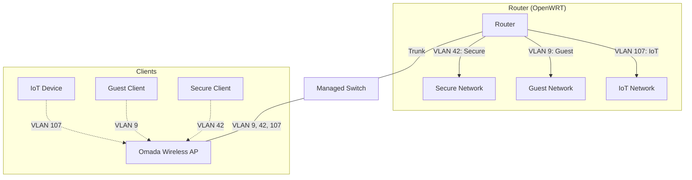

# homelab

All my homelab files

## Folder structure

```
service
|-- region-env-node (ie: lhr1-prod-1)
|   |-- compose.yaml
|   |-- data_folders
```

Where Region is one of:

- `lhr1`
- `slc1`
- `iad1`
- `sgu1`

And env is one of:

- `prod`
- `stage`
- `dev`

> Do not use a mix of "full" words and "short" words, such as `prod`, `staging`, `dev`, `development`. Always use the short form.

### Why are there multiple nodes in a region?

If a service is a "data" service, ie: nextcloud or immich, then we want the data to be stored on a NAS
rather than directly on the service. When we run a backup job, we don't want the data to be backed up
twice. The only way this works is if the node is a VM rather than an LXC, but I'd rather work with
LXC containers for most services. So there are generally two nodes, a service-only LXC node, and a VM.

## Traefik Labels

When adding traefik labels, add the full `region-env-node` name to the key, but the actual host can be short.

The name of the router should be `servicenamewithnospaces-env-node-protocol`

> Note that we've dropped the region. That's because by the time something hits traefik, the region has been decided. (and it's in the domain anyway)

The HostName should be `service{.env?}.region.jakerob.pro

e.g:

```yaml
labels:
  traefik.enable: true
  traefik.http.routers.uptimekuma-prod-1-http.entrypoints: web
  traefik.http.routers.uptimekuma-prod-1-http.rule: Host(`uptime.lhr1.jakerob.pro`)
  traefik.http.routers.uptimekuma-prod-1-https.entrypoints: websecure
  traefik.http.routers.uptimekuma-prod-1-https.rule: Host(`uptime.lhr1.jakerob.pro`)
```

Or for a staging example

```yaml
labels:
  traefik.enable: true
  traefik.http.routers.uptimekuma-stage-1-http.entrypoints: web
  traefik.http.routers.uptimekuma-stage-1-http.rule: Host(`uptime.stage.lhr1.jakerob.pro`)
  traefik.http.routers.uptimekuma-stage-1-https.entrypoints: websecure
  traefik.http.routers.uptimekuma-stage-1-https.rule: Host(`uptime.stage.lhr1.jakerob.pro`)
```

## Network Diagram

| Host          | DHCP Reservation |
| ------------- | ---------------- |
| proxmox       | 192.168.42.10    |
| pi-hole       | 192.168.42.11    |
| docker-node-2 | 192.168.42.15    |



## Why do I commit all folders with a .gitkeep?

This ensures that when you clone it, the folders are created with the right ownership.

If they are auto created by the docker containers, sometimes they are still created with ownership of `root`

## FAQ

- How can I fix the locales issue?
  `sudo dpkg-reconfigure locales`

- I get an error running that, locales is not installed
   `sudo apt install locales`

- My Dialog is broken
    `sudo apt install dialog`

## Git Pre commit hooks

```zsh
infisical scan install --pre-commit-hook
```

## DB

I normally would rather keep a separate DB container per service, to aid in isolation.

However, this is tricky, because my box is almost out of memory already. So for memory optimizations,
I will begin having a shared DB that is used in all services.

It looks like this will be the following DBs:

- MySQL
- Postgres
- Redis

## How to setup Proxmox

1. Install Proxmox
2. Change the update repository to no-subscription
3. Setup the https certificate
   1. Datacenter > ACME > Register Account
   2. Datacenter > ACME > Plugin (Cloudflare)
   3. lhr1 > System > Certificates
